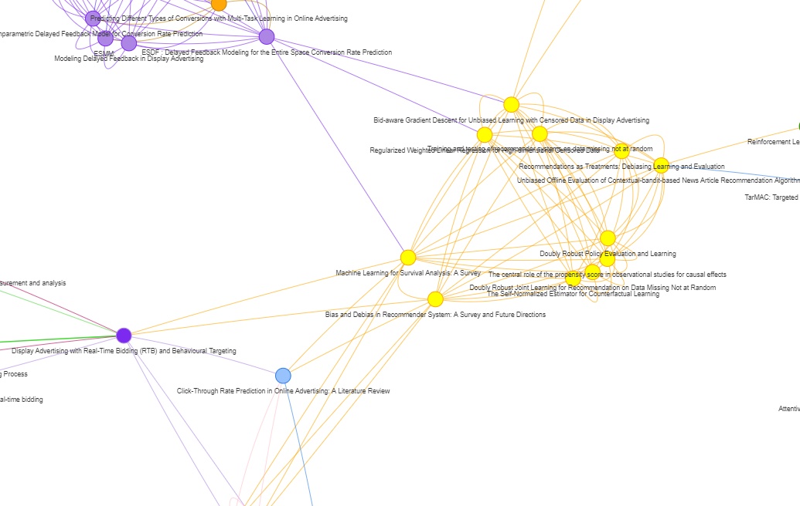

# 🐋 Orque Graph View : Bidirectional Graph view from Notion Database

<!-- #region -->

Visualize your notion database in a graph view. With "Tags" as a multiselect feautre, you can graph-view your notion database.

Built with FastAPI, React-ts, visjs, Vite and Notion api.